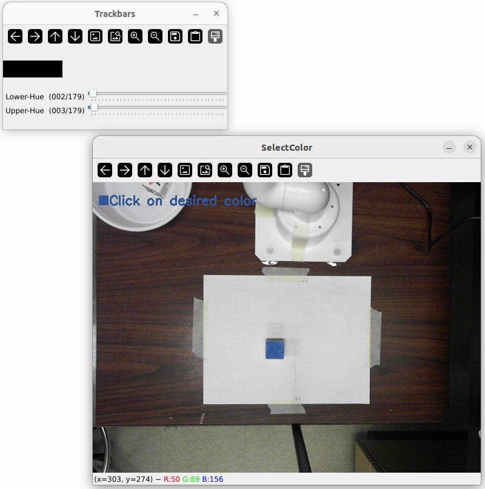

## Requirements
### System
- OS: Ubuntu 22.04 LTS
- ROS 2: Humble Hawksbill
### Programs
- Python 3 (system default)
  - Dependencies (examples — install as needed):
    - pymycobot
	```
        python3 -m pip install pymycobot
    ```
    - OpenCV
	```sh
	    python3 -m pip install opencv-python
	```

## Executing the Program
### Step 1
Launching the MoveIt visualization or hardware bridge. If you have the hardware and want to run with hardware bridge then you can run:
```sh
    ros2 launch hardware_jetcobot_pkg jetcobot_moveit_hardware.launch.py
```
or if you just want to run in the simulation (but with the real camera and position) then you can go with the demo launch from moveit setup:

```sh
    ros2 launch moveit_jetcobot_pkg demo.launch.py
```

### Step 2
Running the node that plan and execute the joint states based on the provided end-effector Pose:
```sh
    ros2 run moveit_jetcobot_pkg move_to_target_pose
```

### Step 3
The **Main** controller that handles all the intermidiate operations like get the Pose from vision pipeline and follow the whole state machine for completing the pick and place operations for that detected object is Pick and Place Coordinator. This can be run as:
```sh
    ros2 run intermidiate_controller_pkg pick_place_coordinator
```

### Step 4
Finally for the vision pipeline, which is responsible for detecting the selected color, creating counter, calculate and publish the actual Pose of the detected colored object, you can follow command:
```sh
ros2 run vision_pipeline_pkg poses_from_countours_node
```
This will allow to select the desired color from the image and provide the trackbar for adjust the upper and lower hue threshold values for the selected color. As you can see in this image.



After selecting the color and setting the threshold offset, you asked to click the **Start** button. The button is the black rectengle on the trackbar window. This will start the vision pipeline for detecting and publishing the Pose.

## Demonstration Video
[Demo Video](https://umanitoba-my.sharepoint.com/:v:/g/personal/baskotag_myumanitoba_ca/EezrGErAjtNAtMbKe6NVBvsBJIdItO_THLsjkkRXoKgmOA?nav=eyJyZWZlcnJhbEluZm8iOnsicmVmZXJyYWxBcHAiOiJPbmVEcml2ZUZvckJ1c2luZXNzIiwicmVmZXJyYWxBcHBQbGF0Zm9ybSI6IldlYiIsInJlZmVycmFsTW9kZSI6InZpZXciLCJyZWZlcnJhbFZpZXciOiJNeUZpbGVzTGlua0NvcHkifX0&e=YI5zGR)
